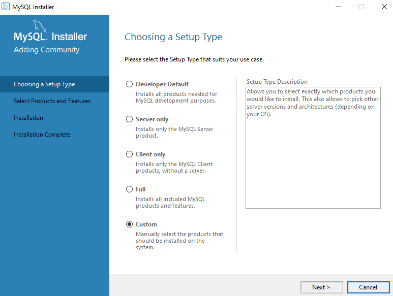

# Instalacja środowiska pracy

1. Pobierz instalator ze [strony producenta](https://dev.mysql.com/downloads/installer/)
2. Podążaj za instalatorem
  
  
  
  
  
  
  
  
  
jeśli nie uda się zainstalować prerekwizyt Microsoft Visual C++ 2019 Redistributable Package (x64) możesz pobrać ten
prerekwizyt ze strony:
  https://visualstudio.microsoft.com/pl/downloads/

  
  
  
  
  
  
  
  
  
  
  
  
  
  
  
Zależnie od preferencji możesz wybrać punkt 3.1 lub 3.2. W ramach zajęć nie będzie miało znaczenia czy wolisz używać CLI
czy narzędzia graficznego.

3.1. Uruchom CLI i użyj hasła które ustawione zostało w ramach instalacji.
  
  

3.2. Uruchom Workbench i użyj hasła ustawionego w ramach instalacji
  
  
  

4. Stwórz bazę danych sda_test
5. Utwórz użytkownika z loginem odpowiadającym Twojemu imieniu
6. Nadaj uprawnienia "do wszystkiego" utworzonemu użytkownikowi

Materiały pomocnicze:
  [Dokumentacja GRANT](https://dev.mysql.com/doc/refman/8.0/en/grant.html)