# Instalacja środowiska pracy

## 1. Pobierz instalator ze [strony producenta](https://dev.mysql.com/downloads/installer/)

## 2. Podążaj za instalatorem

  
  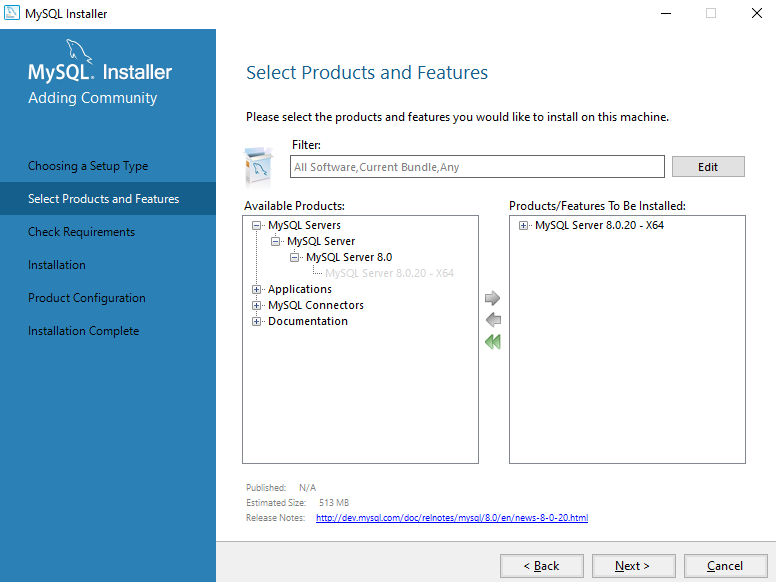
  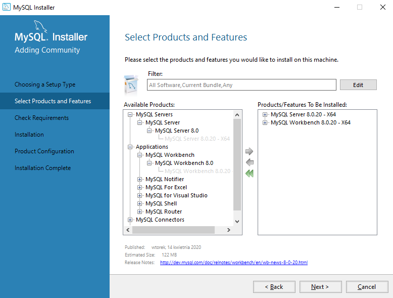
  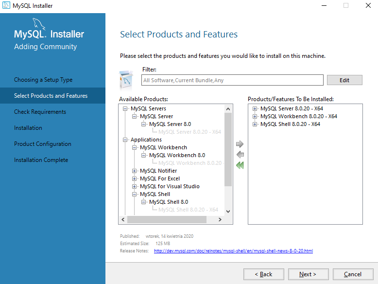
  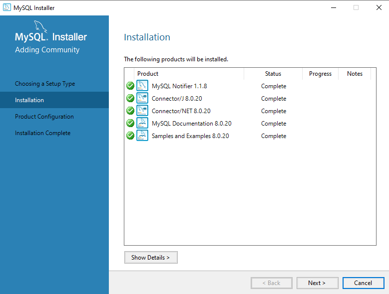
  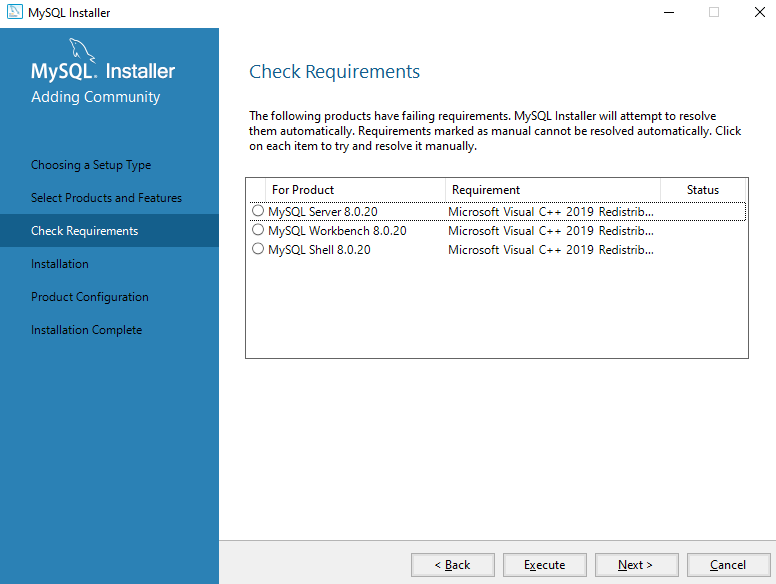
  
  
  

jeśli nie uda się zainstalować prerekwizyt Microsoft Visual C++ 2019 Redistributable Package (x64) możesz pobrać ten
prerekwizyt ze strony:
  https://visualstudio.microsoft.com/pl/downloads/

  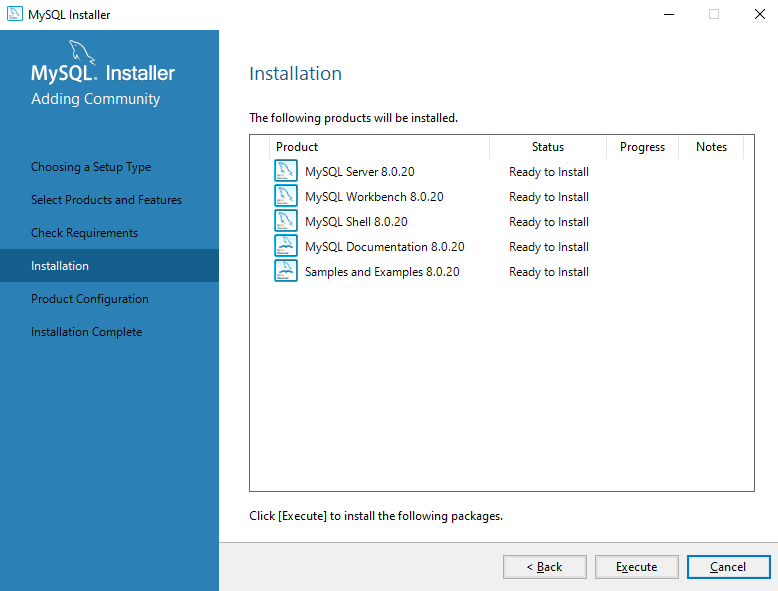
  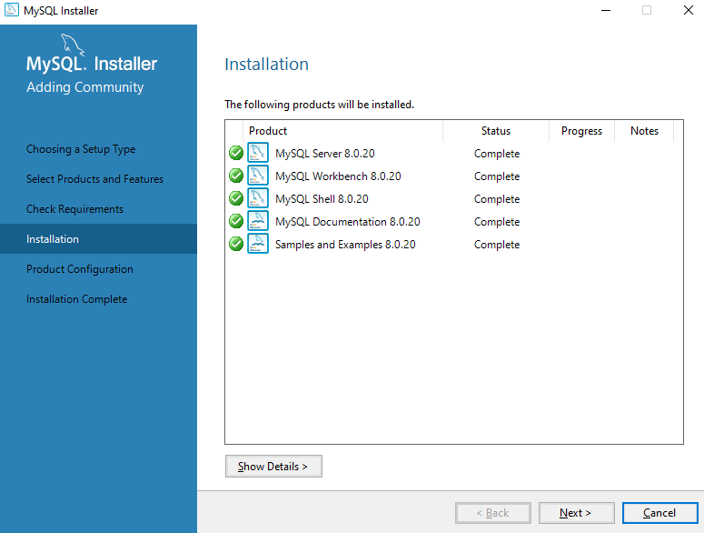
  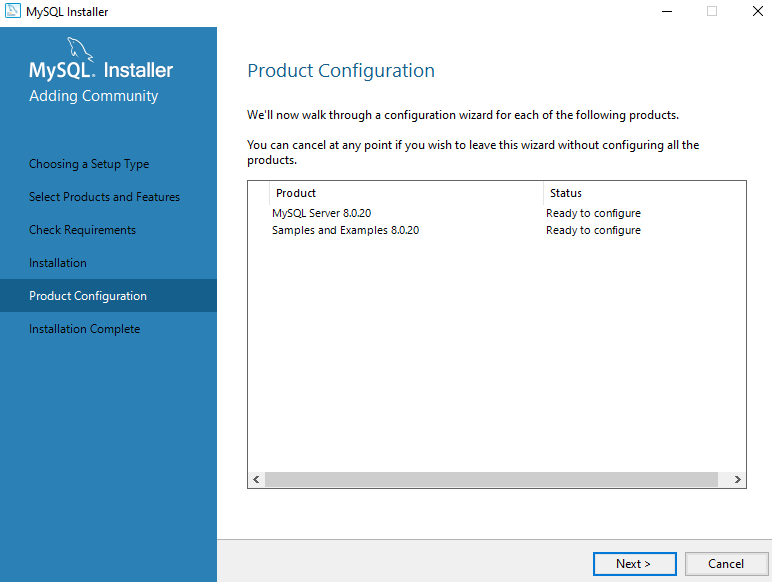
  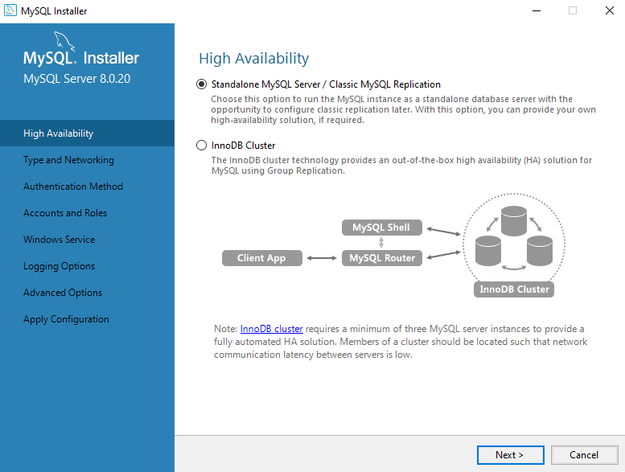
  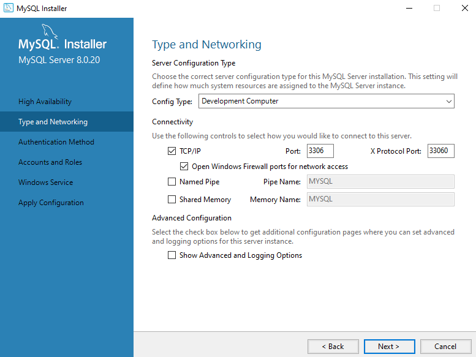
  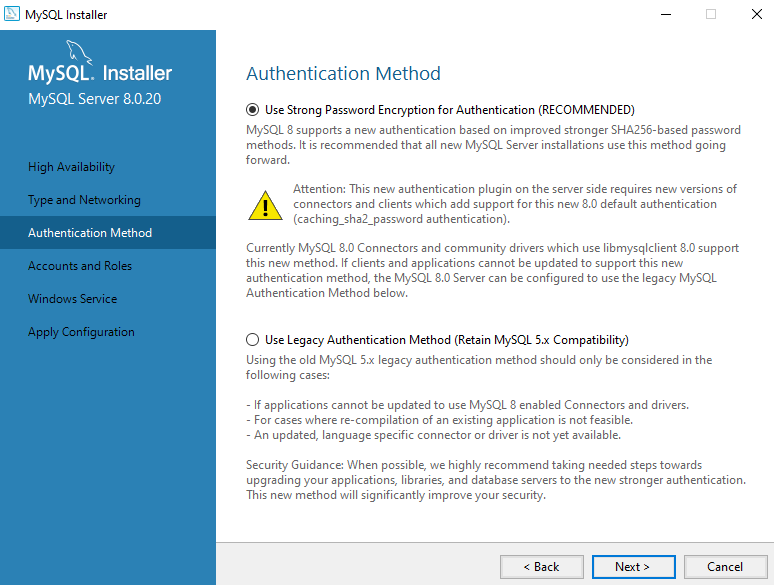
  
  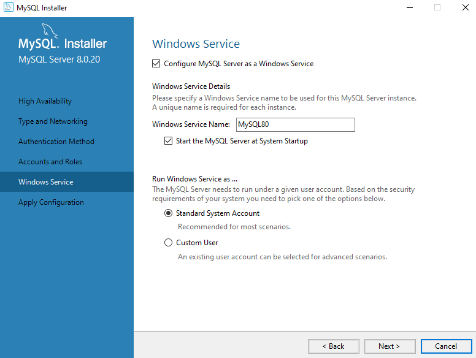
  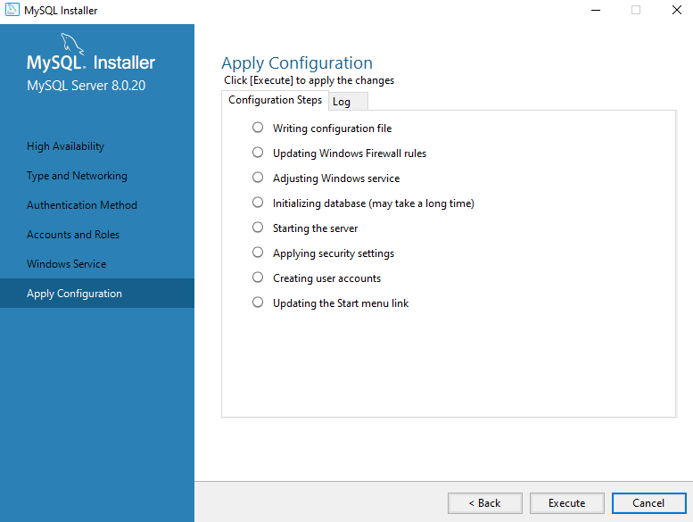
  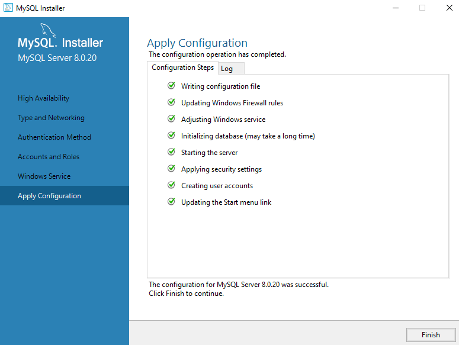
  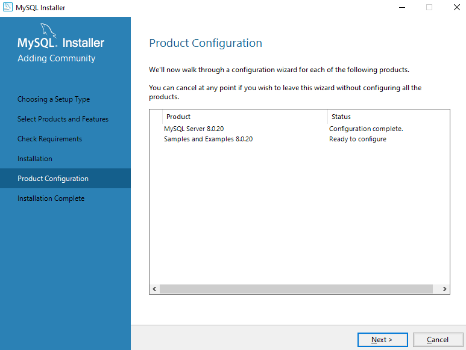
  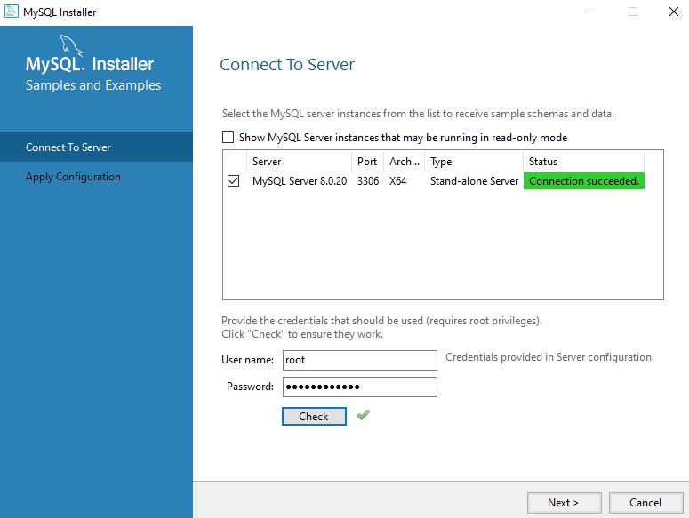
  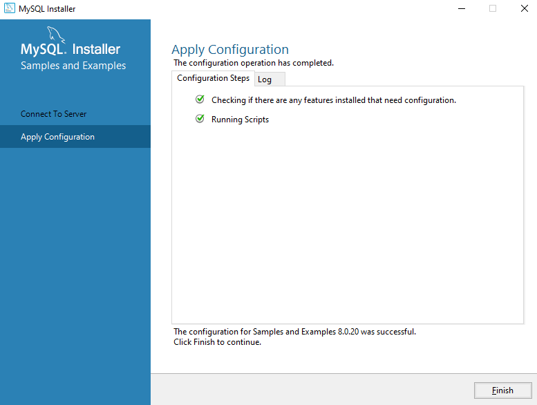
  
  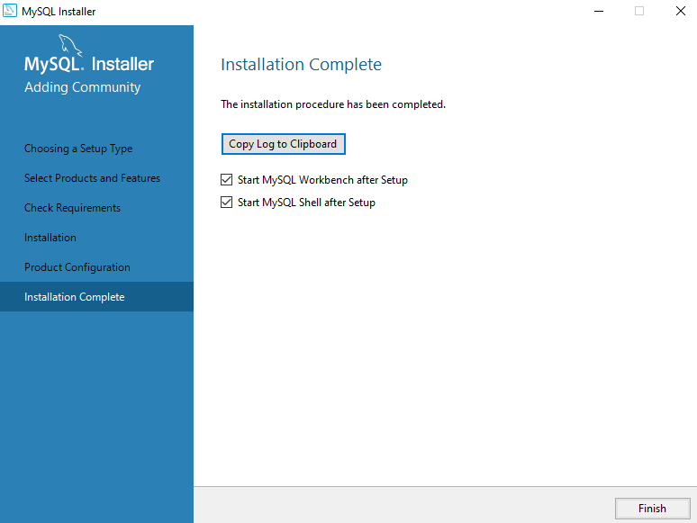
Zależnie od preferencji możesz wybrać punkt 3.1 lub 3.2. W ramach zajęć nie będzie miało znaczenia czy wolisz używać CLI
czy narzędzia graficznego.

## 3.1. Uruchom CLI i użyj hasła które ustawione zostało w ramach instalacji.

  
  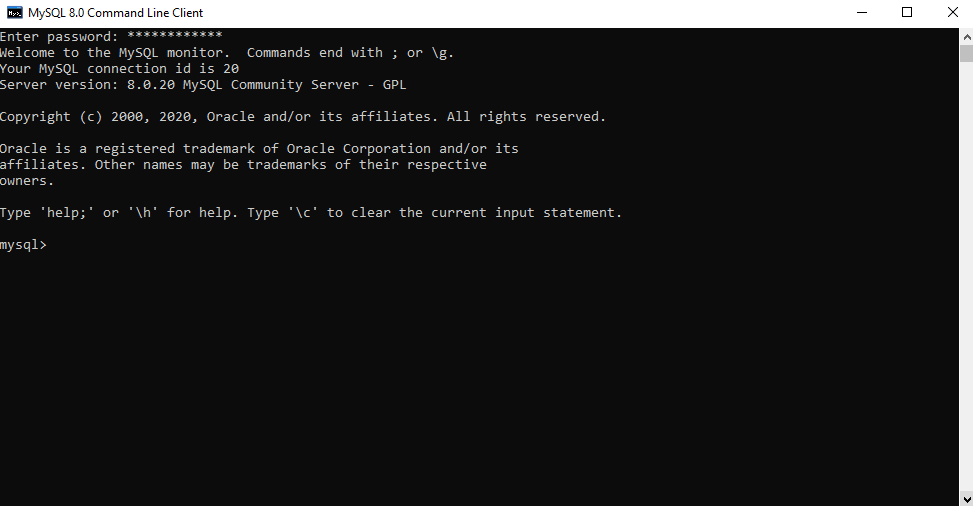

## 3.2. Uruchom Workbench i użyj hasła ustawionego w ramach instalacji

  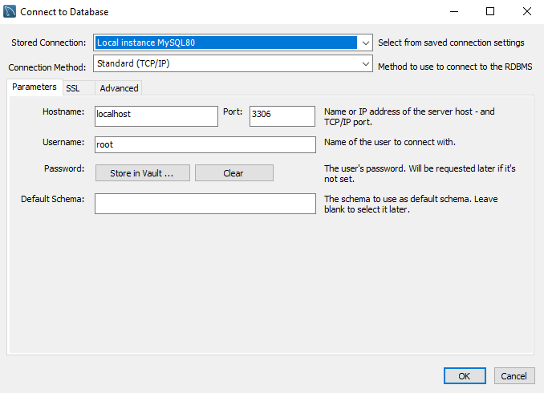
  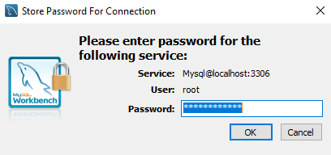
  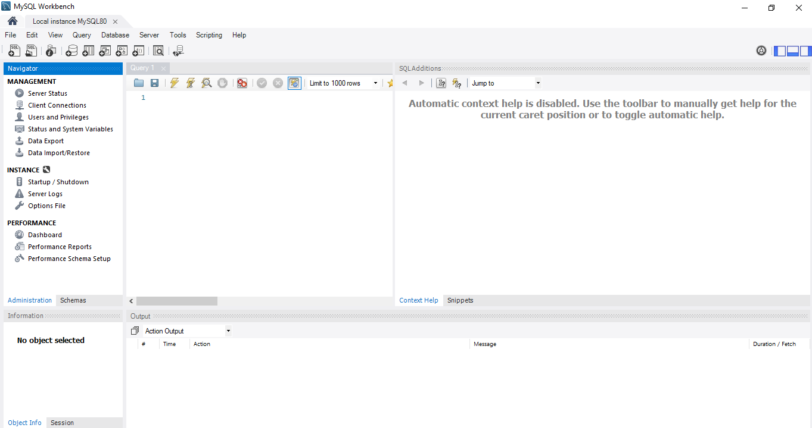

## 4. Stwórz bazę danych sda_test

## 5. Utwórz użytkownika z loginem odpowiadającym Twojemu imieniu

## 6. Nadaj uprawnienia "do wszystkiego" utworzonemu użytkownikowi

Materiały pomocnicze:
  [Dokumentacja GRANT](https://dev.mysql.com/doc/refman/8.0/en/grant.html)